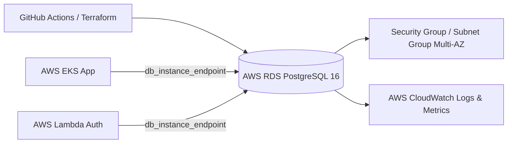

# Oficina Mecânica | Infraestrutura do Banco de Dados (AWS RDS)

Infraestrutura Terraform responsável pelo provisionamento do banco de dados gerenciado **AWS RDS PostgreSQL 16** utilizado pela aplicação Oficina Mecânica.

## Visão Geral

| Item | Informação |
| --- | --- |
| Responsabilidade | Provisionamento, acesso e governança do AWS RDS PostgreSQL |
| IaC | Terraform |
| Plataforma | AWS RDS (Engine PostgreSQL 16) |
| Ambientes | `homologacao` e `production` |
| Pipeline | [GitHub Actions](.github/workflows/ci-cd.yml) |
| Estado operacional | Operacional quando a instância RDS estiver `Available` |

## Arquitetura Geral



## Stack e Componentes

- Terraform >= 1.5.0
- Provider `hashicorp/aws ~> 5.0`
- AWS RDS PostgreSQL 16 (`aws_db_instance`)
- DB Subnet Group multi-AZ (`aws_db_subnet_group`)
- Security Group dedicado (`aws_security_group`)
- Parameter Group customizado (`aws_db_parameter_group`)
- Storage Auto Scaling (gp3 de 20 GiB a 100 GiB)

## Deploy e Acesso

### Deploy Automatizado

O pipeline de CI/CD executa `terraform fmt`, `terraform validate` e `terraform plan` em Pull Requests, e `terraform apply` automático nas branches de `homologacao` e `production`.

### Deploy Manual

```bash
cp terraform.tfvars.example terraform.tfvars
# Edite terraform.tfvars com as credenciais desejadas
terraform init
terraform plan
terraform apply
terraform output
```

### Outputs Principais

Após o apply, os seguintes outputs estarão disponíveis:
- `db_instance_address`: Hostname/DNS do banco RDS.
- `db_instance_port`: Porta TCP (5432).
- `db_instance_endpoint`: Host:porta concatenados.
- `db_security_group_id`: ID do SG para autorizar regras de entrada no EKS/Lambda.

## Integração com Lambda e Aplicação Kubernetes

A Lambda de autenticação e a API FastAPI conectam-se diretamente ao RDS PostgreSQL utilizando o endpoint disponibilizado via AWS SSM Parameter Store ou Secret do Kubernetes.

Credenciais configuradas no SSM:
- `/oficina/db/host`: Hostname do RDS (`aws_db_instance.postgres.address`).
- `/oficina/db/port`: `5432`.
- `/oficina/db/name`: `oficina_db`.
- `/oficina/db/user`: `oficina`.
- `/oficina/db/password`: Senha master configurada via Terraform.

## Documentação Arquitetural Completa

Para detalhes sobre o diagrama de sequência, modelo relacional (ER), RFCs e ADRs de arquitetura, consulte o documento consolidado:
👉 [`docs/arquitetura.md` no repositório app-k8s](../PosTechFiap_Mecanica_app-k8s/docs/arquitetura.md).
