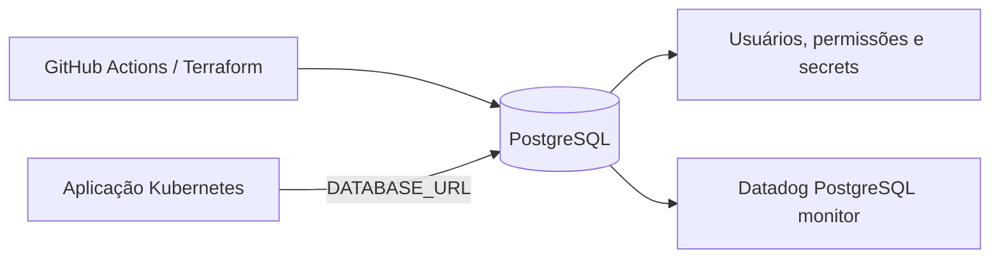

# Oficina Mecânica | Infraestrutura do banco

Infraestrutura Terraform responsável pelo PostgreSQL utilizado pela aplicação Oficina Mecânica.

## Visão geral

| Item | Informação |
| --- | --- |
| Responsabilidade | Provisionamento, acesso e governança do PostgreSQL |
| IaC | Terraform |
| Plataforma | AWS |
| Ambientes | `homologacao` e `production` |
| Pipeline | [GitHub Actions](.github/workflows/ci-cd.yml) |
| Estado operacional | Operacional quando o Terraform apply concluir e o banco aceitar conexões |

## Arquitetura geral



## Stack e componentes

- Terraform 1.8.5
- AWS
- PostgreSQL
- GitHub Actions
- Datadog para disponibilidade, conexões, latência e espaço

## Status operacional e endpoints

| Verificação | Acesso |
| --- | --- |
| Estado da infraestrutura | `terraform output` |
| Healthcheck | `pg_isready` |
| Conexão | `psql "$DATABASE_URL"` |
| Swagger da API | Não se aplica a este repositório |
| Endpoint público | Não existe: banco não é exposto publicamente |

O endpoint da API que utiliza este banco está documentado no repositório [PosTechFiap_Mecanica_app-k8s](../PosTechFiap_Mecanica_app-k8s/README.md).

## Deploy e acesso

### Deploy automatizado

O [pipeline de CI/CD](.github/workflows/ci-cd.yml) executa `fmt`, `validate`, `plan` e `apply` conforme a branch e o ambiente. O endereço do banco é gerado pelo Terraform e deve ser consumido por secret/configuração da aplicação, nunca publicado neste README.

### Deploy manual

```bash
cp terraform.tfvars.example terraform.tfvars
terraform init
terraform plan
terraform apply
terraform output
```

### Acesso ao banco

```bash
psql "$DATABASE_URL"
```

O acesso exige rede permitida e credenciais válidas. Não exponha a porta do PostgreSQL diretamente à internet.

## CI/CD e configuração

Secrets esperados: `AWS_ACCESS_KEY_ID`, `AWS_SECRET_ACCESS_KEY`, `AWS_REGION` e `DB_PASSWORD`. O arquivo `terraform.tfvars` é local e não deve ser versionado.

## Observabilidade

Monitore conexões ativas, backlog, latência de queries, uso de disco, WAL, falhas de escrita e resultado do `pg_isready`. Esses sinais devem ser correlacionados aos dashboards da API e das ordens de serviço no Datadog.

## Estrutura do repositório

```text
database.tf                Recursos do banco
variables.tf               Variáveis Terraform
terraform.tfvars.example   Exemplo de configuração
.github/workflows/         Pipeline de validação e deploy
```

## Segurança e governança

- credenciais somente em secrets e variáveis protegidas;
- aplicar menor privilégio para usuários do banco;
- revisar o `terraform plan` antes de qualquer apply;
- `main` protegida com Pull Request e checks obrigatórios.
